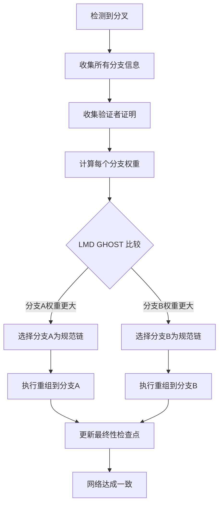
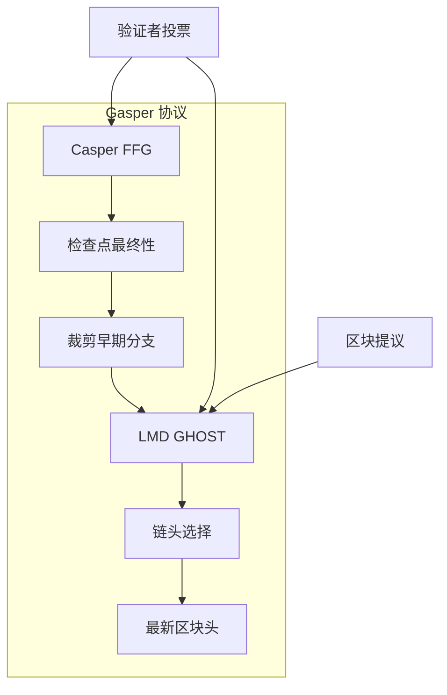
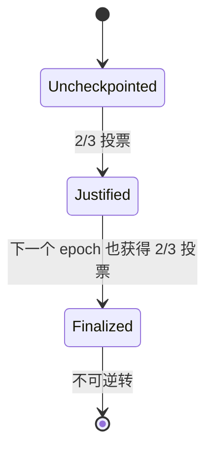

# Fork Choice 规则和安全性保证

## 目录

1. [什么是 Fork Choice](#什么是-fork-choice)
2. [分叉情况分析与一致性实现](#分叉情况分析与一致性实现)
3. [Gasper 协议：LMD GHOST + Casper FFG](#gasper-协议lmd-ghost--casper-ffg)
4. [LMD GHOST 机制详解](#lmd-ghost-机制详解)
5. [Casper FFG 最终性](#casper-ffg-最终性)
6. [安全性保证](#安全性保证)
7. [Geth 中的实现](#geth-中的实现)
8. [攻击防御机制](#攻击防御机制)
9. [历史演进](#历史演进)

---

## 什么是 Fork Choice

### 基本概念

Fork Choice 规则是区块链网络中节点决定哪个区块链分支是"正确"链头的机制。在分布式网络中，可能会出现多个有效的区块链分支（fork），Fork Choice 规则确保所有诚实节点最终收敛到同一条规范链上。

```
          Block 1 ← Block 2 ← Block 3a ← Block 4a
Genesis ←                   ↖
          Block 1 ← Block 2 ← Block 3b ← Block 4b ← Block 5b
                              ↑
                        Fork Choice 需要决定哪条是正确的
```

### 为什么需要 Fork Choice

1. **网络延迟**：区块传播需要时间，可能导致分叉
2. **同时出块**：多个提议者可能同时产生有效区块
3. **恶意行为**：攻击者可能故意创建分叉
4. **网络分割**：临时网络分区可能导致不同链版本

### Fork Choice 的数学表示

Fork Choice 可以表示为一个函数：

```
GetHead(Store) → HeadBlock
```

其中 `Store` 包含节点已知的所有区块、证明和网络状态信息。

---

## 分叉情况分析与一致性实现

### 💭 为什么 PoS 网络仍会出现分叉？

虽然 PoS 中每个 slot 的 proposer 是预先确定的，但分叉仍然不可避免。以下是各种分叉情况及其一致性解决方案：

### 🌐 1. 网络分割场景

#### 分叉产生情况

```
网络分区前：统一的区块链
     ↓
网络分区：两个独立的网络分片
Network A (30% validators) | Network B (70% validators)
   Block 100a              |    Block 100b
      ↓                    |       ↓
   Block 101a              |    Block 101b
      ↓                    |       ↓
   Block 102a              |    Block 102b
```

#### Fork Choice 一致性实现

```python
def handle_network_partition_recovery():
    # 网络重连后，两个分片都有有效链

    # 1. 收集所有已知区块和证明
    all_blocks = gather_all_blocks()
    all_attestations = gather_all_attestations()

    # 2. LMD GHOST 权重计算
    for branch in [branch_a, branch_b]:
        weight = calculate_validator_support(branch, all_attestations)
        branch.total_weight = weight

    # 3. 选择权重最大的分支
    canonical_branch = max(branches, key=lambda b: b.total_weight)

    # 4. Network A 节点发现 Network B 的链更重
    if canonical_branch != current_branch:
        perform_chain_reorg(canonical_branch)

    return canonical_branch
```

#### 具体例子

```
分区恢复后的状态：
- Network A: 30% 验证者支持，总权重 = 9,600 ETH
- Network B: 70% 验证者支持，总权重 = 22,400 ETH

结果：所有节点最终收敛到 Network B 的链
```

### 📡 2. 网络延迟场景

#### 分叉产生情况

```
Slot 100 时间线：
t=0s:  Alice 应该提出区块
t=1s:  Alice 生成 Block 100a
t=2s:  50% 节点收到 Block 100a
t=4s:  Slot 100 结束，剩余节点认为是空 slot
t=5s:  Slot 101 开始，Bob 基于不同状态提出 Block 101

结果：两条分支
- 分支 A: ...Block 99 → Block 100a → Block 101a
- 分支 B: ...Block 99 → (空 slot 100) → Block 101b
```

#### Fork Choice 一致性实现

```go
func handleLateMsgArrival(lateBlock *Block, currentBranch []*Block) {
    // 1. 验证迟到区块的有效性
    if !validateBlock(lateBlock) {
        return // 忽略无效区块
    }

    // 2. 重新计算所有分支权重
    branches := getAllPossibleBranches()

    for _, branch := range branches {
        // 计算支持该分支的验证者总权重
        weight := calculateBranchWeight(branch)
        branch.Weight = weight
    }

    // 3. 执行 LMD GHOST 选择
    newCanonicalBranch := lmdGhostChoice(branches)

    // 4. 如果需要重组，更新规范链
    if newCanonicalBranch.Head() != currentBranch.Head() {
        executeChainReorg(currentBranch, newCanonicalBranch)
    }
}
```

### 🎭 3. 恶意 Proposer 场景

#### 分叉产生情况

```
恶意 Proposer Alice 在 Slot 100 执行双重提议：
- Block 100a: 发送给欧洲验证者
- Block 100b: 发送给美洲验证者

两个区块都是有效的，但交易内容不同：
Block 100a: Alice → Charlie (10 ETH)
Block 100b: Alice → David (10 ETH)  // 双花攻击！
```

#### Fork Choice 一致性实现

```python
def resolve_equivocation_attack():
    # 1. 检测到冲突区块
    conflicting_blocks = detect_conflicting_blocks(slot=100)

    # 2. 收集验证者投票（证明）
    attestations_100a = get_attestations_for_block(block_100a)
    attestations_100b = get_attestations_for_block(block_100b)

    # 3. 计算每个分支的支持权重
    weight_a = sum(validator.effective_balance
                   for validator in attestations_100a)
    weight_b = sum(validator.effective_balance
                   for validator in attestations_100b)

    # 4. LMD GHOST 决策
    if weight_a > weight_b:
        canonical_block = block_100a
        orphaned_block = block_100b
    else:
        canonical_block = block_100b
        orphaned_block = block_100a

    # 5. 标记恶意行为并执行 slashing
    slash_equivocating_proposer(alice)

    # 6. 网络收敛到权重更大的分支
    finalize_canonical_chain(canonical_block)

    return canonical_block
```

### ⚙️ 4. 执行层失败场景

#### 分叉产生情况

```
Alice 提出 Block 100，但包含有问题的交易：
- 50% 节点：执行层验证成功，接受 Block 100
- 50% 节点：执行层验证失败，拒绝 Block 100

结果：
- 分支 A: ...Block 99 → Block 100 → Block 101a
- 分支 B: ...Block 99 → (拒绝 Block 100) → Block 101b
```

#### Fork Choice 一致性实现

```go
func handleExecutionLayerDisagreement(block *Block) ConsensusResult {
    // 1. 执行层验证
    execResult := executionLayer.ValidateBlock(block)

    if execResult.Invalid {
        // 2a. 执行失败：发布 INVALID 证明
        attestation := createInvalidAttestation(block)
        broadcastAttestation(attestation)
        return REJECT_BLOCK
    } else {
        // 2b. 执行成功：发布 VALID 证明
        attestation := createValidAttestation(block)
        broadcastAttestation(attestation)

        // 3. 等待网络收敛
        networkConsensus := waitForNetworkConsensus(block)

        // 4. 基于多数共识决定
        if networkConsensus.ValidPercentage > 50% {
            return ACCEPT_BLOCK
        } else {
            // 多数认为无效，执行重组
            reorgToValidBranch()
            return REJECT_BLOCK
        }
    }
}
```

### 🚀 5. MEV-Boost 相关分叉

#### 分叉产生情况

```
MEV-Boost 流程中的延迟导致分叉：

正常流程：
t=0: Proposer 请求区块
t=1: Relay 返回 sealed block
t=2: Proposer 发布区块
t=4: 证明截止时间

问题流程：
t=0: Proposer 请求区块
t=3: Relay 延迟返回区块
t=4: 证明截止时间已过！
t=5: 下个 proposer 执行 honest reorg
```

#### Fork Choice 一致性实现

```go
func handleMEVBoostFork(lateBlock *Block, honestReorg *Block) {
    // 1. 评估两个区块的时间戳
    lateBlockTime := lateBlock.Timestamp
    reorgBlockTime := honestReorg.Timestamp

    // 2. 应用 Proposer Boost 权重
    var proposerBoostBlock *Block
    if isProposerBoostEligible(lateBlock) {
        proposerBoostBlock = lateBlock
    } else if isProposerBoostEligible(honestReorg) {
        proposerBoostBlock = honestReorg
    }

    // 3. 计算包含 Proposer Boost 的权重
    totalWeight := func(block *Block) uint64 {
        baseWeight := calculateAttestationWeight(block)
        if block == proposerBoostBlock {
            boostWeight := getTotalActiveBalance() * PROPOSER_BOOST_PERCENTAGE / 100
            return baseWeight + boostWeight
        }
        return baseWeight
    }

    // 4. LMD GHOST 决策
    if totalWeight(lateBlock) > totalWeight(honestReorg) {
        canonicalBlock = lateBlock
    } else {
        canonicalBlock = honestReorg
    }

    // 5. 通知执行层进行重组
    notifyExecutionLayer(canonicalBlock)
}
```

### 🔄 6. 一致性实现的核心机制

#### LMD GHOST 权重聚合

```python
def aggregate_validator_support(block_tree):
    """
    聚合所有验证者的最新消息来计算分支权重
    """
    for validator in active_validators:
        latest_message = validator.get_latest_attestation()

        # 找到该证明支持的区块分支
        supported_branch = find_branch_containing(latest_message.block_root)

        # 将验证者权重添加到该分支
        supported_branch.total_weight += validator.effective_balance

    return block_tree
```

#### 分叉解决的实际流程



### 📊 一致性保证的数学基础

#### 安全性定理

```
定理：在诚实验证者 ≥ 2/3 的前提下，
任何两个冲突的检查点不能同时被最终确认

证明：
设 A 和 B 是两个冲突的检查点
如果 A 和 B 都被最终确认，则：
- 至少 2/3 验证者投票支持 A
- 至少 2/3 验证者投票支持 B
- 总计至少 4/3 验证者，矛盾！
```

#### 活性定理

```
定理：在网络同步假设下，如果诚实验证者 ≥ 2/3，
则区块链会持续增长并达到最终性

证明：
- LMD GHOST 确保分叉会在有限时间内解决
- Casper FFG 确保周期性的最终性检查点
- 诚实多数确保恶意分支无法获得足够支持
```

### 🎯 关键理解要点

1. **分叉不可避免**：即使在 PoS 中，网络延迟、分区、恶意行为都会导致分叉
2. **权重决定一切**：Fork Choice 通过验证者质押权重来解决分叉
3. **及时收敛**：LMD GHOST 确保网络快速收敛到同一链头
4. **最终性保证**：Casper FFG 提供周期性的不可逆转确认
5. **攻击防御**：多种机制防御各类攻击，包括 Proposer Boost 等

### 📋 实现中的权衡考虑

基于[Gasper 协议分析](https://learnblockchain.cn/article/4778)的研究，实际实现中存在以下重要权衡：

#### 去中心化 vs 效率

```python
# Attestation Inclusion Delay 机制
def include_attestations(current_slot, n_delay_slots):
    """
    包含最近 n 个 slot 的证明，而不是只包含前一个 slot
    目的：让网络速度较慢的节点也能参与共识
    """
    included_attestations = []
    for slot in range(current_slot - n_delay_slots, current_slot):
        attestations = get_attestations_for_slot(slot)
        included_attestations.extend(attestations)
    return included_attestations
```

#### 安全性 vs 活性

```python
# Attestation Consideration Delay 机制
def consider_attestations_for_fork_choice(current_slot):
    """
    仅考虑 slot ≤ current_slot - 1 的证明
    目的：防止 Equivocation Game 中的 smoke bomb 攻击
    """
    valid_attestations = []
    for attestation in all_attestations:
        if attestation.slot <= current_slot - 1:
            valid_attestations.append(attestation)
    return valid_attestations
```

#### 动态验证者集合的安全挑战

```python
def handle_dynamic_validator_sets():
    """
    处理验证者集合变化带来的安全问题
    """
    # 1. 限制验证者集合变更频率
    max_validator_changes_per_epoch = get_max_changes()

    # 2. 拒绝时间跨度过大的证明
    max_attestation_age = 2 * EPOCHS  # 2个epoch之前的证明被拒绝

    # 3. 确保恶意验证者无法逃脱惩罚
    return enforce_slashing_across_validator_changes()
```

通过这些机制，以太坊网络能够在面对各种分叉情况时维持一致性和安全性，同时在去中心化、效率和安全性之间取得平衡。

---

## Gasper 协议：LMD GHOST + Casper FFG

以太坊的 Fork Choice 使用 **Gasper** 协议，它结合了两个机制：

### 1. LMD GHOST (Latest Message Driven GHOST)

- 负责选择链头
- 基于最新投票消息
- 解决短期分叉

### 2. Casper FFG (Friendly Finality Gadget)

- 负责最终性确认
- 基于检查点机制
- 提供长期安全性

### 协议架构图



---

## LMD GHOST 机制详解

### 核心思想

LMD GHOST (Latest Message Driven Greedy Heaviest Observed SubTree) 选择拥有最多验证者支持的分支作为正确链。

### 工作原理

1. **收集最新消息**：每个验证者的最新证明投票
2. **计算权重**：基于验证者质押量计算分支权重
3. **贪心选择**：从创世块开始，每次选择权重最大的子分支

### 算法步骤

```python
def lmd_ghost_fork_choice(store, root):
    # 从根节点开始
    head = root

    while True:
        children = get_children(head)
        if not children:
            return head

        # 计算每个子节点的权重
        best_child = None
        best_weight = 0

        for child in children:
            weight = get_weight(store, child)
            if weight > best_weight:
                best_weight = weight
                best_child = child

        head = best_child
```

### 权重计算

验证者对区块的支持权重计算：

```python
def get_weight(store, block):
    weight = 0
    for validator in store.validators:
        if supports_block(validator.latest_vote, block):
            weight += validator.effective_balance
    return weight
```

---

## Casper FFG 最终性

### 检查点机制

Casper FFG 使用检查点（checkpoint）来提供最终性：

1. **Epoch 边界**：每 32 个 slot 为一个 epoch
2. **检查点**：每个 epoch 的第一个 slot 作为检查点
3. **投票**：验证者对 source → target 检查点链接投票

### 最终性规则

```
Justified: 2/3 验证者投票支持的检查点
Finalized: 连续两个 justified 检查点，且后者是前者的直接子节点
```

### 状态转换图



---

## 安全性保证

### 1. 活性 (Liveness)

**保证**：如果网络是同步的，且诚实验证者 ≥ 2/3，则链会持续增长。

**机制**：

- LMD GHOST 确保分叉会被解决
- Casper FFG 提供周期性最终性
- 提议者轮换机制避免单点故障

### 2. 安全性 (Safety)

**保证**：两个冲突的区块不能同时被最终确认。

**证明**：如果两个冲突检查点都被最终确认，则至少有 1/3 验证者会被罚没。

### 3. 问责性 (Accountability)

**机制**：

- **Slashing 条件**：违反安全性规则的验证者会被罚没
- **双重投票**：在同一 slot 对不同区块投票
- **环绕投票**：违反 FFG 投票规则

### 4. 抗审查性

**设计**：

- 多样化的验证者集合
- 随机的提议者选择
- Fork Choice 可以惩罚审查行为

---

## Geth 中的实现

### Engine API 接口

在 Geth 中，Fork Choice 主要通过 Engine API 实现，这是共识层与执行层通信的标准接口。

#### ForkchoiceStateV1 结构

```go
// go-ethereum/beacon/engine/types.go
type ForkchoiceStateV1 struct {
    HeadBlockHash      common.Hash `json:"headBlockHash"`
    SafeBlockHash      common.Hash `json:"safeBlockHash"`
    FinalizedBlockHash common.Hash `json:"finalizedBlockHash"`
}
```

#### Fork Choice 响应

```go
type ForkChoiceResponse struct {
    PayloadStatus PayloadStatusV1 `json:"payloadStatus"`
    PayloadID     *PayloadID      `json:"payloadId"`
}
```

### 核心实现位置

| 组件       | 文件路径              | 职责                        |
| ---------- | --------------------- | --------------------------- |
| Engine API | `eth/catalyst/api.go` | 处理 ForkchoiceUpdated 调用 |
| 状态更新   | `beacon/engine/`      | 定义数据结构和错误处理      |
| 区块链逻辑 | `core/blockchain.go`  | 实际的分叉处理逻辑          |

### ForkchoiceUpdated 处理流程

```go
// eth/catalyst/api.go
func (api *ConsensusAPI) forkchoiceUpdated(
    update engine.ForkchoiceStateV1,
    payloadAttributes *engine.PayloadAttributes,
    payloadVersion engine.PayloadVersion,
    payloadWitness bool
) (engine.ForkChoiceResponse, error) {

    // 1. 验证输入参数
    if update.HeadBlockHash == (common.Hash{}) {
        log.Warn("Forkchoice requested update to zero hash")
        return engine.STATUS_INVALID, engine.InvalidForkChoiceState
    }

    // 2. 检查区块是否存在
    block := api.eth.BlockChain().GetBlockByHash(update.HeadBlockHash)
    if block == nil {
        // 触发同步或拒绝更新
        return engine.ForkChoiceResponse{PayloadStatus: *res, PayloadID: nil}, nil
    }

    // 3. 验证最终性和安全性
    if !api.validForkchoiceState(update) {
        return engine.STATUS_INVALID, engine.InvalidForkChoiceState
    }

    // 4. 应用分叉选择
    return api.updateForkchoice(update, payloadAttributes)
}
```

### 分叉验证逻辑

```go
func (api *ConsensusAPI) validForkchoiceState(update engine.ForkchoiceStateV1) bool {
    // 检查最终区块
    if update.FinalizedBlockHash != (common.Hash{}) {
        finalBlock := api.eth.BlockChain().GetBlockByHash(update.FinalizedBlockHash)
        if finalBlock == nil {
            return false
        }
        // 确保最终区块在规范链上
        if !api.eth.BlockChain().IsCanonical(finalBlock) {
            return false
        }
    }

    // 检查安全区块
    if update.SafeBlockHash != (common.Hash{}) {
        safeBlock := api.eth.BlockChain().GetBlockByHash(update.SafeBlockHash)
        if safeBlock == nil {
            return false
        }
        if !api.eth.BlockChain().IsCanonical(safeBlock) {
            return false
        }
    }

    return true
}
```

---

## 攻击防御机制

### 1. 提议者提升 (Proposer Boost)

**目的**：防止平衡攻击，确保及时最终性。

**机制**：给当前 slot 的提议者额外的投票权重。

```python
def get_proposer_boost_weight(store, block):
    current_slot = get_current_slot(store)
    if block.slot == current_slot and is_proposer(block):
        return PROPOSER_BOOST_PERCENTAGE * total_active_balance // 100
    return 0
```

### 2. 等值权衡保护

**问题**：攻击者可以通过等值权衡攻击延迟最终性。

**解决方案**：

- 只考虑当前和前一个 epoch 的证明
- 实现 "unrealized justification" 逻辑

### 3. 重组攻击防御

**Ex Ante 重组攻击**：

```python
def filter_block_tree(store, block_root, blocks):
    # 过滤掉不可行的分支
    blocks = {root: block for root, block in blocks.items()
              if is_viable_for_head(store, block)}
    return blocks

def is_viable_for_head(store, block):
    # 确保区块是从合理检查点派生的
    return is_descendant_of_finalized(store, block)
```

### 4. Slashing 检测

```go
// 检测双重投票
func detectDoubleVote(att1, att2 *Attestation) bool {
    return att1.Data.Slot == att2.Data.Slot &&
           att1.Data.BeaconBlockRoot != att2.Data.BeaconBlockRoot
}

// 检测环绕投票
func detectSurroundVote(att1, att2 *Attestation) bool {
    return (att1.Data.Source.Epoch < att2.Data.Source.Epoch &&
            att1.Data.Target.Epoch > att2.Data.Target.Epoch) ||
           (att1.Data.Source.Epoch > att2.Data.Source.Epoch &&
            att1.Data.Target.Epoch < att2.Data.Target.Epoch)
}
```

---

## 历史演进

### 时间线

| 时间    | 事件                   | 影响                    |
| ------- | ---------------------- | ----------------------- |
| 2018.07 | Vitalik 发布 mini-spec | 初始 PoS 设计           |
| 2018.11 | IMD GHOST → LMD GHOST  | 解决稳定性问题          |
| 2019.04 | 首个 Fork Choice 规范  | 96 行代码               |
| 2019.08 | Decoy Flip-Flop 攻击   | 添加 epoch 边界检查     |
| 2019.09 | Bouncing 攻击          | 限制 justified 更新时间 |
| 2019.11 | 不可行分支问题         | 添加分支过滤逻辑        |
| 2021.07 | 边缘情况修复           | 维护检查点不变量        |
| 2021.11 | Proposer Boost         | 防止平衡攻击            |
| 2022.01 | 等值权衡攻击           | 排除 slashed 验证者     |
| 2022.03 | Equivocating 防御      | 更强的攻击防护          |
| 2023.04 | Capella 重写           | 简化并加强规范          |

### 复杂性增长

```
2019.04: 96 行
2023.04: 576 行
```

这反映了 Fork Choice 规则在面对各种攻击时不断演进的复杂性。

### 主要攻击类型总结

1. **Decoy Flip-Flop**：通过虚假证明延迟最终性
2. **Bouncing Attack**：无限期延迟最终性
3. **Balancing Attack**：阻止 Casper FFG 最终确认
4. **Ex Ante Reorg**：提议者分叉出先前的区块
5. **Equivocating Attack**：利用等值权衡延迟最终性

---

## 学习要点总结

### 核心概念

- Fork Choice = LMD GHOST + Casper FFG
- 安全性依赖于 2/3 诚实验证者假设
- 活性需要网络同步性假设

### Geth 实现关键

- Engine API 是共识层与执行层的桥梁
- ForkchoiceUpdated 是核心调用
- 需要验证最终性和安全性约束

### 安全考虑

- 多种攻击向量需要防御
- 规范在不断演进以应对新攻击
- 形式化验证变得越来越重要

### 实际应用

- MEV-Boost 集成
- 验证者客户端多样性
- 网络升级机制

---

## 参考资料

1. [Ethereum Fork Choice Specification](https://github.com/ethereum/consensus-specs/blob/dev/specs/phase0/fork-choice.md)
2. [Gasper Paper](https://arxiv.org/abs/2003.03052)
3. [Eth2book - Fork Choice](https://eth2book.info/latest/part3/forkchoice/)
4. [Combining GHOST and Casper](https://arxiv.org/abs/2003.03052)
5. [Geth Engine API Documentation](https://geth.ethereum.org/docs/interacting-with-geth/rpc/engine)

---

_本文档基于 Ethereum 2.0 规范和 Geth 1.15+ 实现编写_

---
