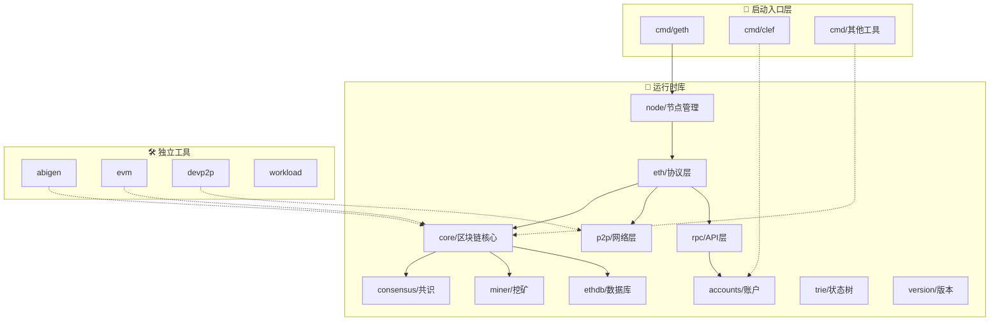

# Geth 项目结构和核心模块概览

## 简介

Geth (Go Ethereum) 是用 Go 语言编写的以太坊客户端实现，是最广泛使用的以太坊执行层客户端。作为以太坊网络的核心组件，Geth 负责处理交易、执行智能合约、维护区块链状态等关键功能。

## 项目整体结构

基于实际的 go-ethereum 项目，我们可以将其按功能和用途分为三个主要层次：

```
go-ethereum/
├── 🚀 节点启动入口层/
├── 🔧 节点运行时库/
├── 🛠️ 独立工具组件/
├── 📁 构建和配置/
└── 📋 文档和测试/
```

---

## 🚀 1. 节点启动入口层

### cmd/ 目录 - 命令行工具集

这是 Geth 项目的入口层，包含各种可执行程序：

#### 核心节点程序

- **`geth/`** ⭐ - 主要的以太坊节点程序
  - 完整的以太坊客户端
  - 支持挖矿、同步、RPC 服务
  - 节点的主要入口点

#### 共识和同步工具

- **`blsync/`** - 信标链同步工具
  - 用于同步信标链数据
  - 支持 PoS 共识机制

#### 密钥和签名工具

- **`clef/`** - 高级账户管理器
  - 安全的密钥管理
  - 交易签名服务
  - 支持硬件钱包
- **`ethkey/`** - 以太坊密钥工具
  - 生成和管理私钥
  - 地址计算和验证

#### 开发和调试工具

- **`evm/`** - EVM 虚拟机工具
  - 独立的 EVM 执行环境
  - 智能合约测试和调试
- **`abigen/`** - ABI 绑定生成器
  - 从 Solidity ABI 生成 Go 绑定
  - 简化智能合约交互
- **`abidump/`** - ABI 提取工具
  - 从合约字节码提取 ABI

#### 网络和协议工具

- **`devp2p/`** - P2P 网络工具
  - 节点发现和连接测试
  - 网络协议调试
- **`rlpdump/`** - RLP 编码工具
  - RLP 数据格式解析
  - 调试序列化问题

#### 存储和归档工具

- **`era/`** - Era 归档工具
  - 历史数据归档
  - 长期存储管理

#### 性能测试工具

- **`workload/`** - 工作负载测试
  - 性能基准测试
  - 压力测试工具

#### 通用工具库

- **`utils/`** - 命令行通用工具
  - 共享的 CLI 功能
  - 参数解析和配置

---

## 🔧 2. 节点运行时库

这些是 Geth 节点运行时必需的核心库模块：

### 核心区块链模块

- **`core/`** ⭐⭐⭐ - 区块链核心逻辑
  ```
  core/
  ├── vm/           # EVM 虚拟机实现
  ├── state/        # 状态管理和 MPT
  ├── types/        # 区块和交易数据结构
  ├── txpool/       # 交易池管理
  ├── rawdb/        # 底层数据库操作
  └── forkid/       # 分叉 ID 管理
  ```

### 共识机制

- **`consensus/`** - 共识算法实现

  - **Ethash**: PoW 挖矿算法 (历史兼容 + 私有网络)
  - **Clique**: PoA 权威证明 (测试网络)
  - **Beacon**: PoS 信标链接口 (主网当前使用)

  > 📝 **注意**: 以太坊主网已于 2022 年 9 月转向 PoS，但保留 PoW 代码用于历史区块验证和私有网络

### 节点管理

- **`node/`** - 节点生命周期管理
  - 服务注册和启动
  - 配置管理
  - 生命周期控制
  - API 端点管理

### 网络和协议层

- **`eth/`** - 以太坊协议实现
  - 区块同步逻辑
  - 交易广播
  - 协议升级处理
- **`p2p/`** - 点对点网络库
  - 节点发现 (Discovery)
  - 连接管理
  - 消息路由
- **`beacon/`** - 信标链集成
  - Engine API 实现
  - PoS 共识支持

### 账户和密钥管理

- **`accounts/`** - 账户管理系统
  ```
  accounts/
  ├── abi/          # ABI 编码解码
  ├── keystore/     # 密钥存储
  ├── usbwallet/    # USB 硬件钱包
  └── scwallet/     # 智能卡钱包
  ```

### 数据存储

- **`ethdb/`** - 数据库抽象层
  - LevelDB 接口
  - 批量操作支持
  - 内存数据库
- **`trie/`** - Merkle Patricia Trie
  - 状态树实现
  - 证明生成和验证
- **`triedb/`** - Trie 数据库管理
  - Trie 节点缓存
  - 垃圾回收

### 挖矿模块

- **`miner/`** - 挖矿功能 (主要用于历史兼容)

  - 区块组装
  - 工作量证明计算 (PoW 网络)
  - 奖励分配

  > 📝 **注意**: 主网已停止 PoW 挖矿，但代码保留用于历史区块处理和私有网络

### API 和接口

- **`rpc/`** - RPC 服务框架
  - JSON-RPC 2.0 实现
  - WebSocket 支持
  - IPC 通信
- **`graphql/`** - GraphQL API
  - 灵活的查询接口
  - 替代 REST API
- **`ethclient/`** - 以太坊客户端库
  - Go 语言 SDK
  - 简化的 API 接口

### 工具和基础库

- **`common/`** - 通用数据类型和工具
  - 地址、哈希、大数处理
  - 十六进制编码
  - 数学运算
- **`crypto/`** - 密码学库
  - ECDSA 签名
  - Keccak-256 哈希
  - BLS 签名（PoS 用）
- **`rlp/`** - RLP 序列化
  - 递归长度前缀编码
  - 以太坊标准编码格式
- **`params/`** - 网络参数
  - 硬分叉配置
  - Gas 价格参数
  - 协议常量
- **`metrics/`** - 性能监控
  - 指标收集
  - 性能分析
- **`log/`** - 日志系统
  - 结构化日志
  - 多级别输出
- **`event/`** - 事件系统
  - 发布订阅模式
  - 异步事件处理
- **`version/`** - 版本管理
  - 版本信息管理
  - 兼容性检查

### 内部工具库 (internal/)

- **`ethapi/`** - 内部 API 实现
- **`jsre/`** - JavaScript 运行环境
- **`web3ext/`** - Web3 扩展
- **`debug/`** - 调试工具
- **`flags/`** - 命令行标志
- **`version/`** - 版本管理
- **`guide/`** - 向导工具
- **`shutdowncheck/`** - 关闭检查
- **`reexec/`** - 重新执行工具

---

## 🛠️ 3. 独立工具组件

这些组件可以独立使用，与节点运行没有直接关系：

### 开发工具

- **`abigen/`** - 智能合约 Go 绑定生成器
  - 从 ABI 生成 Go 代码
  - 简化 DApp 开发
- **`abidump/`** - ABI 提取工具
  - 反编译合约 ABI
  - 调试工具

### 测试和基准工具

- **`evm/`** - 独立 EVM 执行器
  - 合约测试环境
  - Gas 消耗分析
- **`rlpdump/`** - RLP 数据解析器
  - 调试序列化问题
  - 数据格式验证
- **`workload/`** - 性能基准测试
  - 压力测试工具
  - 性能分析

### 网络诊断工具

- **`devp2p/`** - P2P 网络测试套件
  - 节点连接测试
  - 协议兼容性检查
  - 网络诊断

### 密钥管理工具

- **`ethkey/`** - 密钥生成和管理
  - 离线密钥操作
  - 地址生成工具
- **`clef/`** (也可独立使用) - 高级签名器
  - 独立的签名服务
  - 硬件钱包支持

### 数据处理工具

- **`era/`** - 历史数据归档
  - 数据压缩和存储
  - 长期归档管理

### 系统集成工具

- **`signer/`** - 外部签名器接口
  - 与外部钱包集成
  - API 标准化

---

## 🏗️ 4. 构建和配置

### 构建系统

- **`build/`** - 构建脚本和工具
  - CI/CD 配置
  - 跨平台编译
- **`Makefile`** - Make 构建规则
- **`go.mod`** / **`go.sum`** - Go 模块依赖

### 容器化

- **`Dockerfile`** - Docker 构建配置
- **`Dockerfile.alltools`** - 包含所有工具的镜像

### 配置文件

- **`.gitignore`** - Git 忽略规则
- **`.golangci.yml`** - 代码质量检查
- **`circle.yml`** / **`.travis.yml`** / **`appveyor.yml`** - CI 配置

---

## 📋 5. 文档和测试

### 文档

- **`docs/`** - 项目文档
- **`README.md`** - 项目介绍
- **`SECURITY.md`** - 安全政策

### 测试套件

- **`tests/`** - 官方测试套件
  - 以太坊协议一致性测试
  - 跨客户端兼容性测试
- **`internal/testlog/`** - 测试日志工具
- **`internal/testrand/`** - 测试随机数
- **`internal/utesting/`** - 单元测试工具
- **`internal/cmdtest/`** - 命令行测试
- **`internal/blocktest/`** - 区块测试

### 状态监控

- **`ethstats/`** - 以太坊网络统计
  - 节点状态上报
  - 网络监控

### 交互界面

- **`console/`** - JavaScript 控制台
  - 交互式命令行
  - Web3 API 访问

---

## 三层架构关系说明

### 🚀 节点启动入口层的作用

- **统一入口**：`cmd/geth` 是整个节点的启动入口
- **工具集合**：提供各种独立的命令行工具
- **配置解析**：处理启动参数和配置文件
- **服务编排**：协调各个运行时库的启动

### 🔧 节点运行时库的特点

- **核心依赖**：节点运行必须依赖这些库
- **模块化设计**：每个库负责特定功能
- **相互协作**：库之间存在依赖和交互关系
- **生命周期管理**：随节点启动和关闭

### 🛠️ 独立工具组件的优势

- **独立部署**：可以单独编译和运行
- **专用功能**：针对特定任务设计
- **开发调试**：便于开发和测试
- **工具生态**：丰富以太坊工具生态

---

## 架构交互关系图



## 学习建议

### 按层次学习路径

1. **入门阶段**：

   - 从 `cmd/geth` 开始，理解节点启动流程
   - 学习 `common/` 包的基础数据类型
   - 了解 `params/` 中的网络配置

2. **核心理解**：

   - 深入 `core/` 模块，理解区块链核心逻辑
   - 研究 `core/vm/` EVM 实现
   - 学习 `eth/` 协议实现

3. **网络和共识**：

   - 探索 `p2p/` 网络协议
   - 理解 `consensus/` 共识机制
   - 学习 `beacon/` PoS 集成

4. **高级主题**：
   - 研究 `trie/` 和 `triedb/` 状态树
   - 深入 `miner/` 挖矿实现
   - 了解 `accounts/` 密钥管理

### 实践建议

- **工具使用**：先熟悉各种独立工具的使用
- **代码阅读**：从测试用例开始理解功能
- **实验环境**：搭建本地测试网络
- **贡献代码**：参与开源项目贡献

---

## 参考资料

- [Geth GitHub Repository](https://github.com/ethereum/go-ethereum)
- [Geth Documentation](https://geth.ethereum.org/docs/)
- [Ethereum Protocol Specification](https://ethereum.github.io/execution-specs/)
- [Go Ethereum Book](https://goethereumbook.org/)

_基于 go-ethereum 实际项目结构的深度学习整理_
