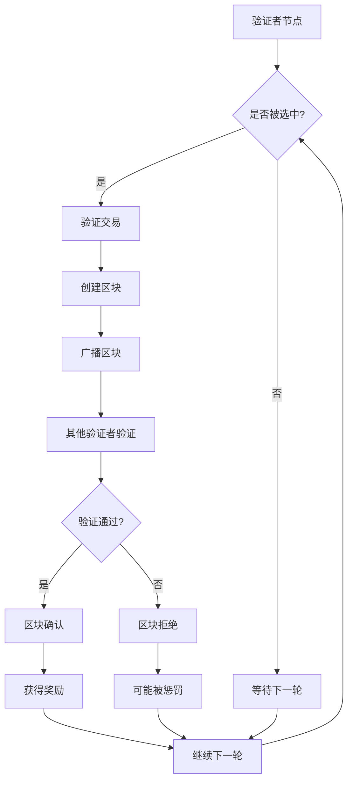
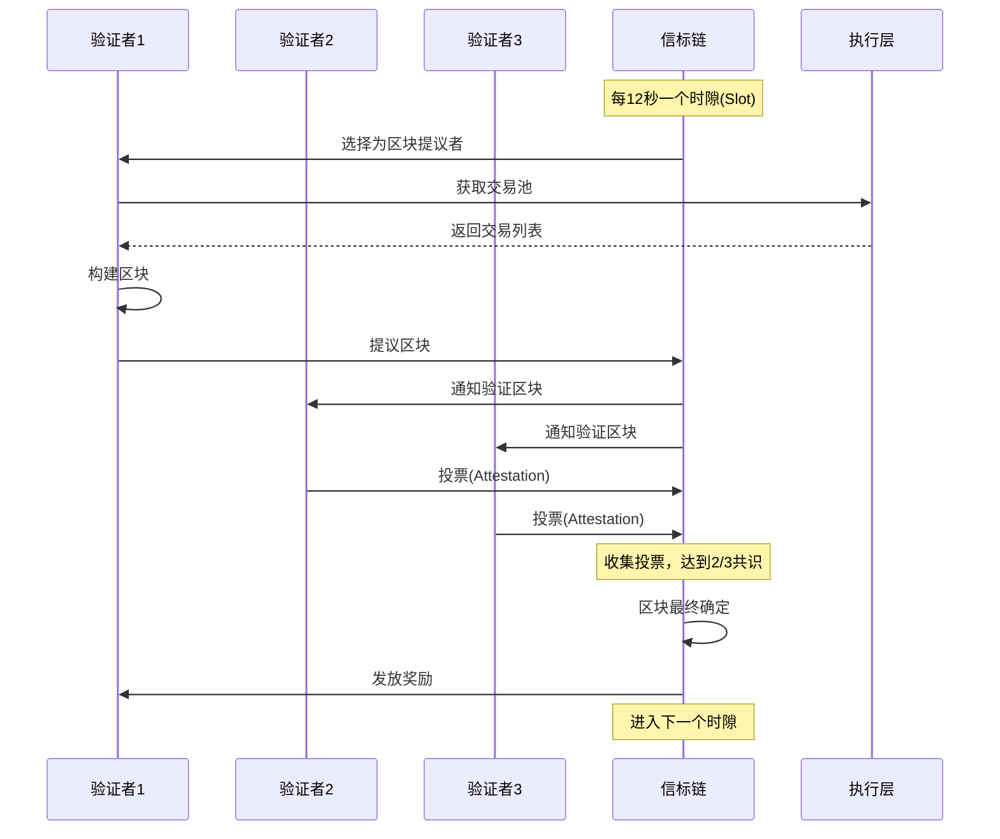
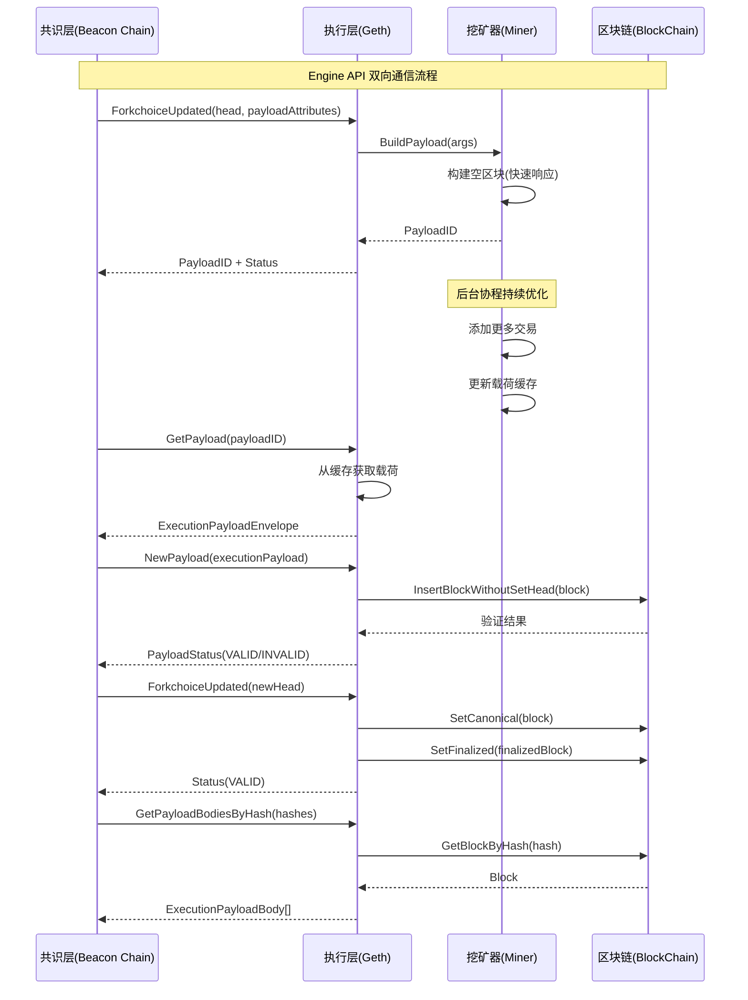
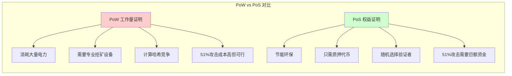

# 以太坊 PoS (Proof-of-Stake) 共识机制深度解析

## WHAT - 什么是 PoS？

### 定义

**权益证明（Proof-of-Stake，PoS）** 是一种区块链共识机制，用于处理交易和创建新区块。根据 [Investopedia](https://www.investopedia.com/terms/p/proof-stake-pos.asp) 的定义：

> PoS 是一种验证分布式数据库条目并保持数据库安全的方法。在加密货币的情况下，数据库被称为区块链，因此共识机制保护区块链的安全。

### 核心特点

1. **基于权益的选择**：验证者根据其质押的代币数量被选中
2. **节能环保**：相比 PoW，能耗降低 99.84%
3. **经济激励**：通过奖励和惩罚机制确保网络安全
4. **随机性**：下一个区块生产者通过随机选择确定，但权益越大概率越高

### PoS 解决的问题

#### 1. 能源消耗问题

- **PoW 问题**：比特币挖矿消耗的能源相当于一些小国家的用电量
- **PoS 解决方案**：用质押代替计算，大幅降低能耗

#### 2. 硬件门槛问题

- **PoW 问题**：需要专业的 ASIC 挖矿设备，门槛高
- **PoS 解决方案**：只需持有和质押代币，降低参与门槛

#### 3. 网络拥堵问题

- **PoW 问题**：基于竞争的奖励机制导致网络拥堵
- **PoS 解决方案**：移除竞争激励，提高网络效率

## HOW - PoS 是如何实现的？

### 工作流程



### 详细流程时序图



### 关键机制

#### 1. 验证者选择机制

- **质押要求**：以太坊要求质押 32 ETH 成为验证者
- **选择算法**：使用伪随机数生成器，权益越大被选中概率越高
- **委员会制度**：验证者被分组到不同的委员会中

#### 2. 奖励与惩罚机制

- **奖励**：正确验证区块获得交易费和区块奖励
- **惩罚（Slashing）**：恶意行为将被罚没部分质押资金
- **不活跃惩罚**：离线验证者会被扣除少量奖励

#### 3. 最终确定性（Finality）

- **检查点**：每个 epoch（32 个 slot）设置检查点
- **两轮投票**：需要两轮超级多数投票确认最终性
- **不可逆转**：一旦最终确定，区块不可被撤销

### Go-Ethereum 中的 PoS 实现

Go-Ethereum 中的 PoS 实现不仅仅是验证区块，而是一个完整的共识引擎系统，包括区块构建、验证、最终化和与共识层的通信。

#### 核心架构组件

##### 1. Beacon 共识引擎 (`consensus/beacon/consensus.go`)

```go
// Beacon 是结合 eth1 共识和权益证明算法的共识引擎
// 它是一个半功能的共识引擎，主要用于必要的共识检查
type Beacon struct {
    ethone consensus.Engine // eth1 中使用的原始共识引擎，如 ethash 或 clique
}
```

**核心常量定义：**

```go
// 权益证明协议常量
var (
    beaconDifficulty = common.Big0          // 信标共识中的默认区块难度（0）
    beaconNonce      = types.EncodeNonce(0) // 信标共识中的默认区块随机数（0）
)
```

##### 2. Engine API (`eth/catalyst/api.go`)

Engine API 是执行层与共识层通信的关键接口，实现了以下核心功能：

```go
type ConsensusAPI struct {
    eth               *eth.Ethereum
    remoteBlocks      *headerQueue
    localBlocks       *payloadQueue
    invalidBlocksHits map[common.Hash]int
    invalidTipsets    map[common.Hash]*types.Header
    // ... 其他字段
}
```

**主要 API 方法：**

- `NewPayloadV1/V2/V3/V4`: 接收共识层提供的新区块
- `ForkchoiceUpdatedV1/V2/V3`: 更新分叉选择状态
- `GetPayloadV1/V2/V3`: 获取构建的区块载荷

##### 3. 区块构建器 (`miner/payload_building.go`)

```go
// BuildPayloadArgs 包含构建载荷的提供参数
type BuildPayloadArgs struct {
    Parent       common.Hash           // 父区块哈希
    Timestamp    uint64                // 时间戳
    FeeRecipient common.Address        // 费用接收者地址
    Random       common.Hash           // 随机数值
    Withdrawals  types.Withdrawals     // 提款列表
    BeaconRoot   *common.Hash          // 信标根（Cancun 升级）
    Version      engine.PayloadVersion // 载荷版本
}
```

#### 关键功能实现

##### 1. 区块验证流程

**区块头验证 (`VerifyHeader`)**：

```go
func (beacon *Beacon) VerifyHeader(chain consensus.ChainHeaderReader, header *types.Header) error {
    // 获取父区块
    parent := chain.GetHeader(header.ParentHash, header.Number.Uint64()-1)
    if parent == nil {
        return consensus.ErrUnknownAncestor
    }

    // 验证不能从 post-merge 回退到 pre-merge
    if parent.Difficulty.Sign() == 0 && header.Difficulty.Sign() > 0 {
        return consensus.ErrInvalidTerminalBlock
    }

    // 根据难度值判断使用哪种验证规则
    if header.Difficulty.Sign() > 0 {
        return beacon.ethone.VerifyHeader(chain, header) // PoW 规则
    }
    return beacon.verifyHeader(chain, header, parent) // PoS 规则
}
```

**PoS 特定验证 (`verifyHeader`)**：

```go
func (beacon *Beacon) verifyHeader(chain consensus.ChainHeaderReader, header, parent *types.Header) error {
    // 1. 验证 extra-data 大小限制（最大 32 字节）
    if len(header.Extra) > int(params.MaximumExtraDataSize) {
        return fmt.Errorf("extra-data longer than 32 bytes (%d)", len(header.Extra))
    }

    // 2. 验证 nonce 和 uncle hash 为预期值
    if header.Nonce != beaconNonce {
        return errInvalidNonce
    }
    if header.UncleHash != types.EmptyUncleHash {
        return errInvalidUncleHash
    }

    // 3. 验证时间戳必须大于父区块
    if header.Time <= parent.Time {
        return errInvalidTimestamp
    }

    // 4. 验证难度为默认常量（0）
    if beaconDifficulty.Cmp(header.Difficulty) != 0 {
        return fmt.Errorf("invalid difficulty: have %v, want %v", header.Difficulty, beaconDifficulty)
    }

    // 5. 验证 EIP-1559 属性
    if err := eip1559.VerifyEIP1559Header(chain.Config(), parent, header); err != nil {
        return err
    }

    // 6. 验证提款哈希（Shanghai 升级）
    shanghai := chain.Config().IsShanghai(header.Number, header.Time)
    if shanghai && header.WithdrawalsHash == nil {
        return errors.New("missing withdrawalsHash")
    }

    // 7. 验证 Cancun 升级相关字段
    cancun := chain.Config().IsCancun(header.Number, header.Time)
    if cancun && header.ParentBeaconRoot == nil {
        return errors.New("header is missing beaconRoot")
    }

    return nil
}
```

##### 2. 区块构建流程

**载荷构建 (`buildPayload`)**：

```go
func (miner *Miner) buildPayload(args *BuildPayloadArgs, witness bool) (*Payload, error) {
    // 1. 构建初始空区块版本（快速生成，确保有内容可交付）
    emptyParams := &generateParams{
        timestamp:   args.Timestamp,
        forceTime:   true,
        parentHash:  args.Parent,
        coinbase:    args.FeeRecipient,
        random:      args.Random,
        withdrawals: args.Withdrawals,
        beaconRoot:  args.BeaconRoot,
        noTxs:       true, // 空区块，无交易
    }
    empty := miner.generateWork(emptyParams, witness)
    if empty.err != nil {
        return nil, empty.err
    }

    // 2. 创建载荷对象
    payload := newPayload(empty.block, empty.requests, empty.witness, args.Id())

    // 3. 启动后台协程持续更新载荷以最大化收益
    go func() {
        timer := time.NewTimer(0)
        defer timer.Stop()

        for {
            select {
            case <-payload.stop:
                return
            case <-timer.C:
                // 构建包含交易的完整区块
                fullParams := &generateParams{
                    timestamp:   args.Timestamp,
                    forceTime:   true,
                    parentHash:  args.Parent,
                    coinbase:    args.FeeRecipient,
                    random:      args.Random,
                    withdrawals: args.Withdrawals,
                    beaconRoot:  args.BeaconRoot,
                    noTxs:       false, // 包含交易
                }
                full := miner.generateWork(fullParams, witness)
                if full.err == nil {
                    payload.update(full, time.Since(start))
                }
                timer.Reset(miner.config.Recommit)
            }
        }
    }()

    return payload, nil
}
```

##### 3. 区块最终化流程

**区块最终化 (`Finalize`)**：

```go
func (beacon *Beacon) Finalize(chain consensus.ChainHeaderReader, header *types.Header, state vm.StateDB, body *types.Body) {
    if !beacon.IsPoSHeader(header) {
        beacon.ethone.Finalize(chain, header, state, body)
        return
    }

    // 处理提款操作（Shanghai 升级后）
    for _, w := range body.Withdrawals {
        // 将金额从 gwei 转换为 wei
        amount := new(uint256.Int).SetUint64(w.Amount)
        amount = amount.Mul(amount, uint256.NewInt(params.GWei))
        state.AddBalance(w.Address, amount, tracing.BalanceIncreaseWithdrawal)
    }
    // 注意：PoS 中没有区块奖励，奖励由共识层发放
}
```

**区块组装 (`FinalizeAndAssemble`)**：

```go
func (beacon *Beacon) FinalizeAndAssemble(chain consensus.ChainHeaderReader, header *types.Header, state *state.StateDB, body *types.Body, receipts []*types.Receipt) (*types.Block, error) {
    // 1. 处理 Shanghai 升级的提款
    shanghai := chain.Config().IsShanghai(header.Number, header.Time)
    if shanghai {
        if body.Withdrawals == nil {
            body.Withdrawals = make([]*types.Withdrawal, 0)
        }
    }

    // 2. 最终化区块
    beacon.Finalize(chain, header, state, body)

    // 3. 设置最终状态根
    header.Root = state.IntermediateRoot(true)

    // 4. 组装最终区块
    block := types.NewBlock(header, body, receipts, trie.NewStackTrie(nil))

    // 5. 创建区块见证（Verkle 树支持）
    if chain.Config().IsVerkle(header.Number, header.Time) {
        // 生成 Verkle 证明
        keys := state.AccessEvents().Keys()
        // ... 见证生成逻辑
        block = block.WithWitness(&types.ExecutionWitness{
            StateDiff:   stateDiff,
            VerkleProof: verkleProof,
        })
    }

    return block, nil
}
```

##### 4. Engine API 通信

**新载荷处理 (`NewPayload`)**：

```go
func (api *ConsensusAPI) newPayload(params engine.ExecutableData, versionedHashes []common.Hash, beaconRoot *common.Hash, requests [][]byte, witness bool) (engine.PayloadStatusV1, error) {
    // 1. 加锁防止并发处理同一载荷
    api.newPayloadLock.Lock()
    defer api.newPayloadLock.Unlock()

    // 2. 将载荷数据转换为区块
    block, err := engine.ExecutableDataToBlock(params, versionedHashes, beaconRoot, requests)
    if err != nil {
        return api.invalid(err, nil), nil
    }

    // 3. 检查是否已经拥有该区块
    if api.eth.BlockChain().HasBlock(block.Hash(), block.NumberU64()) {
        log.Debug("Ignoring already known beacon payload", "number", block.NumberU64(), "hash", block.Hash())
        return engine.PayloadStatusV1{Status: engine.VALID, LatestValidHash: &hash}, nil
    }

    // 4. 验证并插入区块
    _, err = api.eth.BlockChain().InsertBlockWithoutSetHead(block)
    if err != nil {
        log.Warn("NewPayloadV1: inserting block failed", "error", err)
        return api.invalid(err, parent.Header()), nil
    }

    // 5. 返回验证状态
    return engine.PayloadStatusV1{Status: engine.VALID, LatestValidHash: &hash}, nil
}
```

**执行层向共识层提供区块 (`GetPayload`)**：

```go
// 共识层请求获取执行层构建的区块载荷
func (api *ConsensusAPI) GetPayloadV3(payloadID engine.PayloadID) (*engine.ExecutionPayloadEnvelope, error) {
    if !payloadID.Is(engine.PayloadV3) {
        return nil, engine.UnsupportedFork
    }
    return api.getPayload(payloadID, false)
}

func (api *ConsensusAPI) getPayload(payloadID engine.PayloadID, full bool) (*engine.ExecutionPayloadEnvelope, error) {
    log.Trace("Engine API request received", "method", "GetPayload", "id", payloadID)
    // 从本地缓存获取构建好的区块载荷
    data := api.localBlocks.get(payloadID, full)
    if data == nil {
        return nil, engine.UnknownPayload
    }
    return data, nil
}

// 提供历史区块数据
func (api *ConsensusAPI) GetPayloadBodiesByHashV2(hashes []common.Hash) []*engine.ExecutionPayloadBody {
    bodies := make([]*engine.ExecutionPayloadBody, len(hashes))
    for i, hash := range hashes {
        block := api.eth.BlockChain().GetBlockByHash(hash)
        bodies[i] = getBody(block)
    }
    return bodies
}

// 按范围提供区块数据
func (api *ConsensusAPI) getBodiesByRange(start, count hexutil.Uint64) ([]*engine.ExecutionPayloadBody, error) {
    if start == 0 || count == 0 {
        return nil, engine.InvalidParams
    }
    if count > 1024 {
        return nil, engine.TooLargeRequest
    }

    current := api.eth.BlockChain().CurrentBlock().Number.Uint64()
    last := uint64(start) + uint64(count) - 1
    if last > current {
        last = current
    }

    bodies := make([]*engine.ExecutionPayloadBody, 0, uint64(count))
    for i := uint64(start); i <= last; i++ {
        block := api.eth.BlockChain().GetBlockByNumber(i)
        bodies = append(bodies, getBody(block))
    }
    return bodies, nil
}
```

**分叉选择更新 (`ForkchoiceUpdated`)**：

```go
func (api *ConsensusAPI) forkchoiceUpdated(update engine.ForkchoiceStateV1, payloadAttributes *engine.PayloadAttributes, payloadVersion engine.PayloadVersion, payloadWitness bool) (engine.ForkChoiceResponse, error) {
    // 1. 检查头区块是否存在
    block := api.eth.BlockChain().GetBlockByHash(update.HeadBlockHash)
    if block == nil {
        // 触发同步或拒绝更新
        return engine.STATUS_SYNCING, nil
    }

    // 2. 设置新的链头
    if err := api.eth.BlockChain().SetHead(block.NumberU64()); err != nil {
        return engine.STATUS_INVALID, err
    }

    // 3. 设置最终确定区块
    if update.FinalizedBlockHash != (common.Hash{}) {
        finalBlock := api.eth.BlockChain().GetBlockByHash(update.FinalizedBlockHash)
        if finalBlock != nil {
            api.eth.BlockChain().SetFinalized(finalBlock.Header())
        }
    }

    // 4. 设置安全区块
    if update.SafeBlockHash != (common.Hash{}) {
        safeBlock := api.eth.BlockChain().GetBlockByHash(update.SafeBlockHash)
        if safeBlock != nil {
            api.eth.BlockChain().SetSafe(safeBlock.Header())
        }
    }

    // 5. 如果请求构建载荷，启动载荷构建
    if payloadAttributes != nil {
        args := &BuildPayloadArgs{
            Parent:       update.HeadBlockHash,
            Timestamp:    payloadAttributes.Timestamp,
            FeeRecipient: payloadAttributes.SuggestedFeeRecipient,
            Random:       payloadAttributes.Random,
            Withdrawals:  payloadAttributes.Withdrawals,
            BeaconRoot:   payloadAttributes.BeaconRoot,
        }
        payload, err := api.eth.Miner().BuildPayload(args, payloadWitness)
        if err != nil {
            return engine.ForkChoiceResponse{PayloadStatus: engine.PayloadStatusV1{Status: engine.INVALID}}, err
        }
        id := payload.id
        return engine.ForkChoiceResponse{
            PayloadStatus: engine.PayloadStatusV1{Status: engine.VALID, LatestValidHash: &update.HeadBlockHash},
            PayloadID:     &id,
        }, nil
    }

    return engine.ForkChoiceResponse{PayloadStatus: engine.PayloadStatusV1{Status: engine.VALID, LatestValidHash: &update.HeadBlockHash}}, nil
}
```

#### Engine API 完整交互流程



#### 执行层的主动功能

Go-Ethereum 的 PoS 实现包含完整的区块生命周期管理：

##### 1. **区块构建功能**

- 执行层主动构建区块载荷
- 两阶段策略：快速生成空区块 + 持续优化
- 后台协程不断更新以最大化收益

##### 2. **区块提供功能**

- `GetPayload` 系列方法向共识层提供构建好的区块
- `GetPayloadBodies` 系列方法提供历史区块数据
- `GetBlobs` 方法提供 blob 交易数据（EIP-4844）

##### 3. **状态管理功能**

- 管理分叉选择状态
- 设置最终确定和安全区块
- 处理链重组和状态回滚

##### 4. **数据同步功能**

- 支持按哈希和范围查询区块数据
- 提供完整的区块体信息
- 支持见证数据传输（Verkle 树）

这种设计实现了执行层与共识层的完全解耦，执行层不仅是被动的验证者，更是主动的区块构建者和数据提供者。

#### 合并过渡逻辑

**PoW 到 PoS 过渡判断**：

```go
func isPostMerge(config *params.ChainConfig, blockNum uint64, timestamp uint64) bool {
    mergedAtGenesis := config.TerminalTotalDifficulty != nil && config.TerminalTotalDifficulty.Sign() == 0
    return mergedAtGenesis ||
        config.MergeNetsplitBlock != nil && blockNum >= config.MergeNetsplitBlock.Uint64() ||
        config.ShanghaiTime != nil && timestamp >= *config.ShanghaiTime
}
```

**区块类型判断**：

```go
func (beacon *Beacon) IsPoSHeader(header *types.Header) bool {
    if header.Difficulty == nil {
        panic("IsPoSHeader called with invalid difficulty")
    }
    return header.Difficulty.Sign() == 0 // PoS 区块难度为 0
}
```

## WHY - 为什么使用 PoS？

### PoS vs PoW 对比分析



### 详细对比表

| 特性             | PoW (工作量证明)       | PoS (权益证明)        |
| ---------------- | ---------------------- | --------------------- |
| **区块创建者**   | 矿工 (Miners)          | 验证者 (Validators)   |
| **参与要求**     | 购买设备和支付电费     | 拥有并质押代币        |
| **能源效率**     | 低效                   | 高效                  |
| **安全性**       | 通过昂贵的前期投资保证 | 通过社区控制保证      |
| **奖励机制**     | 区块奖励 + 交易费      | 交易费                |
| **51% 攻击成本** | 需要控制 51% 算力      | 需要拥有 51% 质押代币 |
| **网络拥堵**     | 竞争机制可能导致拥堵   | 随机选择减少拥堵      |

### PoS 的优势

#### 1. 环境友好

- **数据支持**：以太坊转向 PoS 后能耗降低 99.84%
- **可持续发展**：符合全球碳中和目标

#### 2. 经济效率

- **降低门槛**：不需要昂贵的挖矿设备
- **资本效率**：质押的代币可以产生收益

#### 3. 网络安全

- **攻击成本**：51% 攻击需要拥有巨额代币
- **惩罚机制**：恶意行为会被罚没质押资金
- **长期激励**：验证者与网络长期利益绑定

#### 4. 可扩展性

- **分片支持**：PoS 更容易实现分片技术
- **快速确认**：12 秒出块时间，相比比特币大幅提升

### PoS 的劣势

#### 1. 富者愈富问题

- **权益集中**：大户更容易获得验证机会
- **潜在风险**：可能导致网络中心化

#### 2. 无利害关系问题 (Nothing at Stake)

- **理论风险**：验证者可能同时验证多个分叉
- **解决方案**：通过 Slashing 机制惩罚

#### 3. 长程攻击 (Long Range Attack)

- **历史重写**：攻击者可能重写很久以前的历史
- **缓解措施**：检查点机制和社会共识

#### 4. 初始分配问题

- **启动困难**：需要预先分配代币给验证者
- **公平性质疑**：初始分配可能不够公平

### 以太坊选择 PoS 的原因

#### 1. 环境压力

- 全球对加密货币环境影响的关注增加
- 监管机构对高耗能区块链的限制

#### 2. 可扩展性需求

- 支持更多用户和应用
- 为分片和 Layer 2 解决方案铺路

#### 3. 经济模型优化

- 更好的代币经济学设计
- 通过质押锁定代币，减少流通供应

#### 4. 技术演进

- PoS 技术逐渐成熟
- 多年研究和测试验证了可行性

## 总结

PoS 共识机制代表了区块链技术的重要演进，它通过经济激励而非计算竞争来维护网络安全。以太坊的成功转型证明了 PoS 的可行性，为整个加密货币行业树立了新的标准。

虽然 PoS 仍面临一些挑战，但其在能效、可扩展性和经济模型方面的优势使其成为下一代区块链网络的首选共识机制。随着技术的不断完善和生态的发展，PoS 将在构建更加可持续和高效的去中心化网络中发挥关键作用。

## 常见问题解答

### Q1: 如果接收到了一个错误出块者的 PoS 区块会发生什么？

在 PoS 中，**执行层并不验证区块提议者的身份**。这是一个关键的架构设计：

#### 执行层的验证范围

```go
// 执行层只验证区块的技术有效性，不验证提议者身份
func (beacon *Beacon) verifyHeader(chain consensus.ChainHeaderReader, header, parent *types.Header) error {
    // 1. 验证区块格式（难度为0、无uncle等）
    if beaconDifficulty.Cmp(header.Difficulty) != 0 {
        return fmt.Errorf("invalid difficulty: have %v, want %v", header.Difficulty, beaconDifficulty)
    }

    // 2. 验证时间戳、gas限制等技术参数
    if header.Time <= parent.Time {
        return errInvalidTimestamp
    }

    // 3. 验证 EIP-1559、提款等协议规则
    // ... 但不验证提议者是否有权限出块
    return nil
}
```

#### 共识层的职责

- **提议者选择验证**：由信标链（共识层）负责
- **签名验证**：验证区块是否由正确的验证者签名
- **时隙验证**：确保区块在正确的时隙提出

#### 错误出块者的处理流程

1. **执行层接收**：技术上有效的区块会被接收和验证
2. **共识层拒绝**：共识层发现提议者错误，拒绝该区块
3. **不会上链**：该区块不会被最终确定，不会成为规范链的一部分
4. **自动清理**：执行层会在后续的 `ForkchoiceUpdated` 中清理无效分叉

### Q2: 不成为 validator，是不是就没机会提交区块了？

**是的，在纯 PoS 网络中，只有注册的验证者才能提议区块。**

#### 验证者要求

```go
// 成为验证者的基本要求
const (
    MinValidatorStake = 32 * 1e18 // 32 ETH
    MaxValidators     = 1048576   // 最大验证者数量
)
```

#### 区块提议流程

1. **验证者注册**：质押 32 ETH 到信标链合约
2. **随机选择**：每个时隙随机选择一个验证者作为提议者
3. **区块构建**：被选中的验证者通过执行层构建区块
4. **区块提议**：验证者向网络广播区块

#### 非验证者的参与方式

虽然不能直接提议区块，但非验证者仍可以：

1. **运行全节点**：验证和同步区块链状态
2. **提供服务**：为验证者提供基础设施服务
3. **委托质押**：通过质押池间接参与（如 Lido、Rocket Pool）
4. **MEV 提取**：通过 MEV-Boost 等机制参与区块构建

#### 代码中的体现

```go
// 执行层的 miner 模块只为验证者服务
func (miner *Miner) buildPayload(args *BuildPayloadArgs, witness bool) (*Payload, error) {
    // 只有收到共识层的构建请求才会执行
    // 这个请求只会发给注册的验证者
    payload := newPayload(empty.block, empty.requests, empty.witness, args.Id())
    return payload, nil
}
```

#### 与 PoW 的对比

| 特性         | PoW                  | PoS                |
| ------------ | -------------------- | ------------------ |
| **参与门槛** | 购买挖矿设备         | 质押 32 ETH        |
| **准入机制** | 无需许可             | 需要注册验证者     |
| **出块权限** | 任何矿工都可以尝试   | 只有被选中的验证者 |
| **奖励分配** | 成功挖出区块获得奖励 | 按质押比例分配奖励 |

这种设计确保了网络的安全性和可预测性，但也意味着参与区块生产需要更高的承诺和门槛。

---

_本文档基于以太坊官方文档、go-ethereum 源代码分析以及相关学术研究整理而成，旨在为深入理解 PoS 共识机制提供全面的技术参考。_
